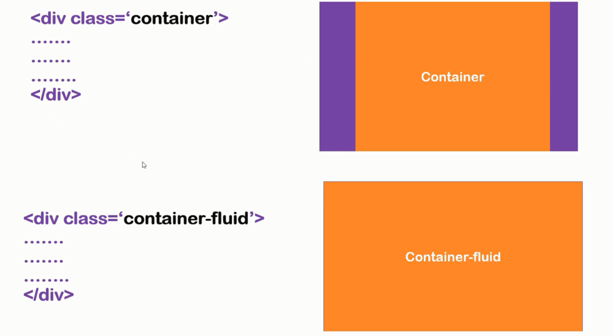
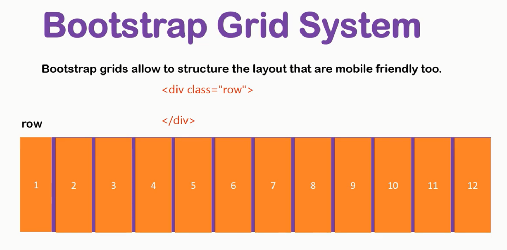
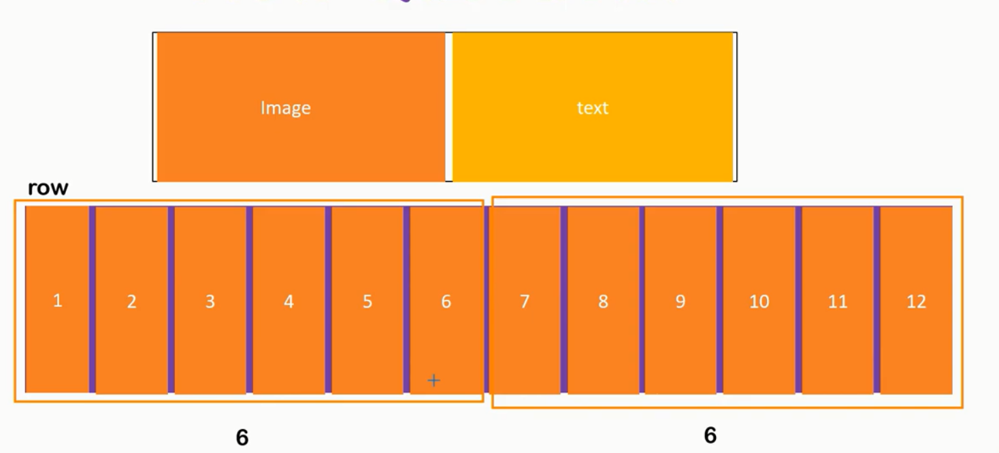
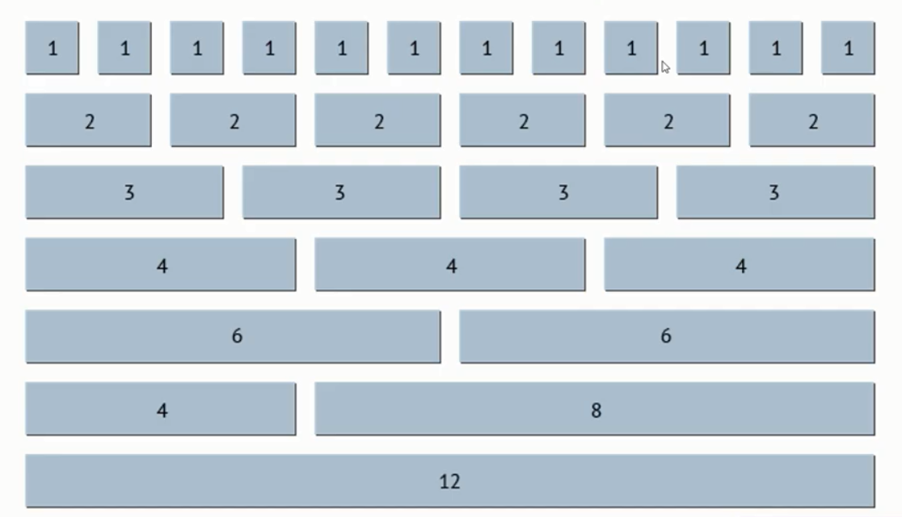
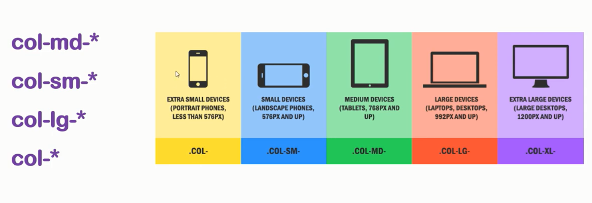
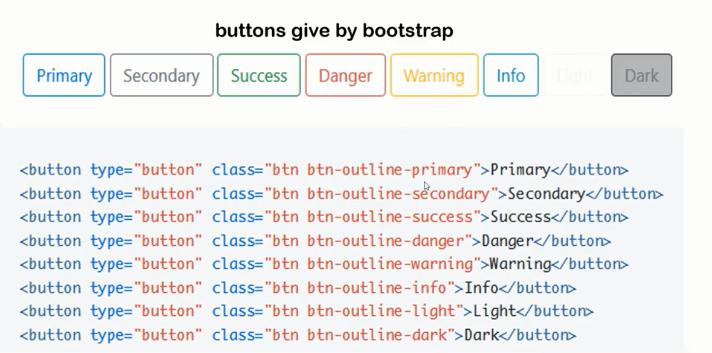
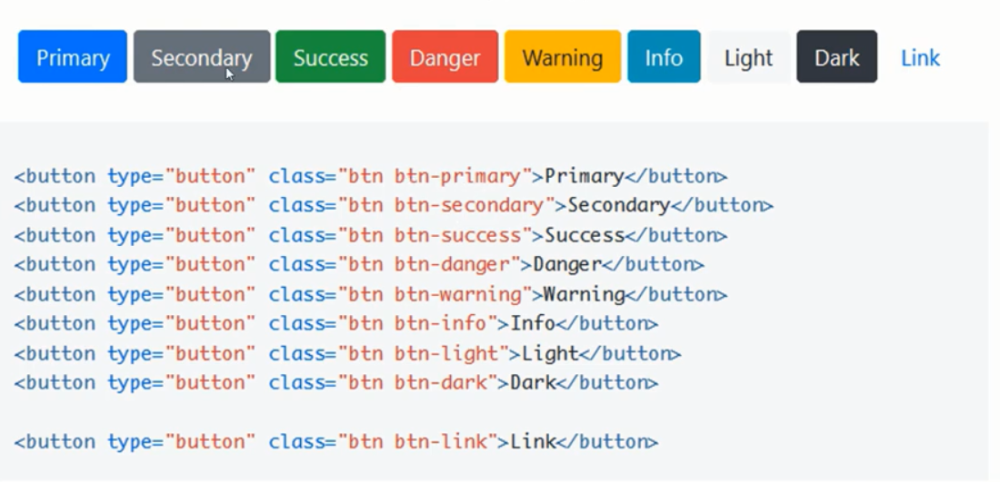
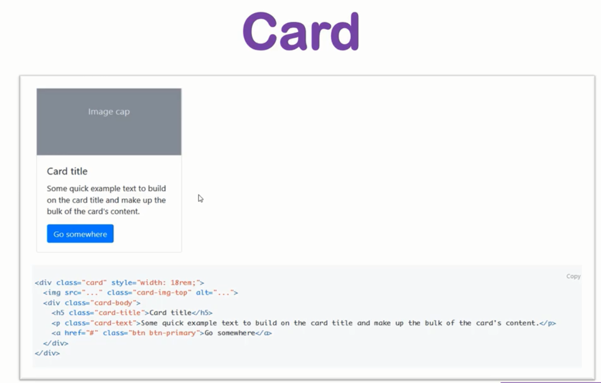

# Documentation of the Project  [](https://github.com/sindresorhus/awesome#readme)
> A very simple web page built mainly with Bootstrap


<br />
<p align="center">
    
  </p>

  <h3 align="center">Bootstrap Basic</h3>


  <!-- TABLE OF CONTENTS -->
  <details open="open">
    <summary>Table of Contents</summary>
    <ol>
      <li>
        <a href="#about-the-project">About The Project</a>
      </li>
      <li><a href="#built-with">Built With</a></li>
      <li><a href="#getting-started">Getting started</a></li>
    </ol>
  </details>


## About the Project

We are gonna make a simple webpage with Bootstrap and learn the basics of it.
## Built With

The project will be built with:

1. Html
2. Javascript
3. CSS
4. Bootstrap


## Getting started

We start by installing vs code and making a simple `index.html` file. We write some basic template in it. We also install live-server plugin for vs-code so that we can see our changes in browser without refreshing every time.

We create a `style.css` file in our `css/` directory and link it in our html by the following snippet in head tag.

```html
 <link rel="stylesheet" href="style.css">
```

We create a javascript file in our `/js` directory and link with the following snippet in our body tag.
```html
 <link rel="stylesheet" href="style.css">
```

***NOTE THAT:***
1. Bootstrap is a framework with popular html, css and javascript
2. Bootstrap is popular because its responsive and mobile friendly (same view is maintain on a mobile without much effort)

Lets learn some basics first. First we need to understand the different effect of bootstrap classes on `div` tag as shown in the image below.

<p align="center">
    
</p>

Then we need to understand how the grid system works in bootstrap. The image below explains it, how each row has 12 grids.

<p align="center">
    
</p>

We can combine this grids to make a column and use it as a holder between image and text to.

<p align="center">
    
</p>

It is not really necessary that the rows are made by equal number of grids. We can divide the grids however we like.

<p align="center">
    
</p>

We need to understand the basic column system too and remember that the hierarchy goes upwards not downward. If we specify the the column for medium size devices (`.COL-MD-*`) then it will be applied or large or extra large devices too but won't be applied to small and extra small devices.

<p align="center">
    
</p>

There are many classes for button too and they display different kinds of effects.

<p align="center">
    
</p>

And some more effects.

<p align="center">
    
</p>

We should also remember a very important element provided by bootstrap which is `card` items.

<p align="center">
    
</p>

So first we need to know that we can use bootstrap in two ways. One is offline and another is online(using `CDN` (content delivery network)). If we had used offline bootstrap then we would have to download all css,javascript and image files and put then in designated folders.

But when we are using online bootstrap in our project, we just need to lin the css (in the header) and javascript (in the body). Best way to get started is to copy paste the starter-template code and add our custom css and javascript to it.


## Adding Navbar

We search Navbar in bootstrap website and select the starter template and paste it.

We see the first line of our navbar is:

```html
<nav class="navbar navbar-expand-lg navbar-light bg-light">
```

here `bg-light` is the background color of the navbar and `navbar-light` is the text's color, both of which we can change by replacing the suffixes.

<p align="center">
    
</p>

We can change `bg-light` to `bg-dark` and `navbar-light` to `navbar-light` and we will see a light colored text on a dark background.

<p align="center">
    
</p>

Another color extension is `*-success` (`navbar-success`, `bg-success`), `*-primary`,`*-warning` etc.

We edit the navbar to give an initial look.

```html
<nav class="navbar navbar-expand-lg navbar-dark bg-dark">
  <a class="navbar-brand" href="#">Bootstrap Test</a>
  <button class="navbar-toggler" type="button" data-toggle="collapse" data-target="#navbarSupportedContent" aria-controls="navbarSupportedContent" aria-expanded="false" aria-label="Toggle navigation">
    <span class="navbar-toggler-icon"></span>
  </button>

  <div class="collapse navbar-collapse" id="navbarSupportedContent">
    <ul class="navbar-nav mr-auto">
      <li class="nav-item active">
        <a class="nav-link" href="#">Home <span class="sr-only">(current)</span></a>
      </li>

      <li class="nav-item">
          <a class="nav-link" href="#">About</a>
        </li>

      <li class="nav-item">
        <a class="nav-link" href="#">Services</a>
      </li>

      <li class="nav-item">
        <a class="nav-link " href="#">Contact</a>
      </li>
    </ul>

  </div>
</nav>
```
which gives us the following look.

<p align="center">
    
</p>

Now to take the text to the write we change the following snippet:

```html
<ul class="navbar-nav mr-auto">
```
to the following:

```html
<ul class="navbar-nav ml-auto">
```

here `ml-auto` makes it right aligned.
